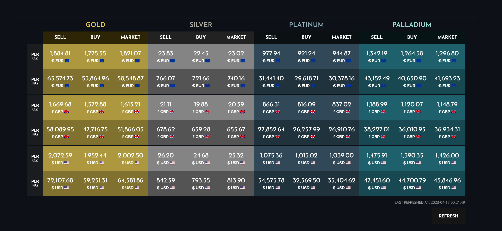

# Metal Prices XMLCharts WordPress Plugin

The Metal Prices XMLCharts WordPress Plugin allows you to display a configurable precious metals price table on your website using a shortcode using the xmlcharts.com API, which has market price data for Gold, Silver, Platinum and Palladium in a variety of currencies. The plugin comes with a refresh button which can refresh the table data via AJAX. 

## How to Install

Go to the [releases](https://github.com/tudor-patrascu/metal-prices-xmlcharts/releases) section of the repository and download the most recent release.

Then, from your WordPress administration panel, go to `Plugins > Add New` and click the `Upload Plugin` button at the top of the page. Go to `Plugins > Installed Plugins` and scroll down until you find Metal Prices XMLCharts, then click on `Activate` to activate the plugin.

## How to Use

### Obtaining API access

Head to the [XMLCharts website price feed page](https://www.xmlcharts.com/precious-metals.html) and click on Subscribe. After following the steps and payment, you will receive an email with the PayPal ID and Password. Head back to the XMLCharts website and click on `Login` at the bottom right of the page and enter with the provided credentials. Then click on Subscriptions at the bottom right of the page. 

In the Precious Metals XPF box, you will need to enter your server (where your WordPress installation is hosted) IP address and domain name (example: yourwebsite.com). Once those are entered, click on Send and the plugin should now be able to access the API. 

### Configuration

After the plugin has been activated, click on `Metal Prices` on the WordPress sidebar to configure it. Once done, click on `Save Changes` to apply all changes.

#### Metals & Weights Setup

Select which metals you want to display. The plugin will create a three columns for each metal selected, with selling prices, buying prices and market prices. At least one metal is required. 

Then, select which weights you want to display. The plugin will create a row for each weight selected. At least one weight is required. 

#### Price Modifiers Setup

Based on the previous options, here you'll be able to set up the buying and selling percentages for each metal and weight selected. Percentages are calculated based on the market price. 

#### Currencies Setup

Select which currencies you want to display. Each selected currency will create one or more rows based on the weights selected. At least one currency is required. 

The available options are AUD (Australian Dollars), BRL (Brazilian Reals), CAD (Canadian Dollars), CHF (Swiss Francs), CNY (Chinese Yuan), EUR (Euros), GBP (British Pounds), INR (Indian Rupees), JPY (Japanese Yuan), MXN (Mexican Pesos), RUB (Russian Rubles), USD (United States Dollars) and ZAR (South African Rand).

#### Other Options

**Display Flags** - show/hide display flags next to each currency symbol.
**Display Market Price** - show/hide the Market price column. 
**Add refresh button** - show/hide the Refresh button.
**Display time of last refresh** - show/hide the a string showing time of last refresh. 

## Shortcode

Place the shortcode `[mpxtable]` anywhere on your site to display the Metal Prices XMLCharts table.

## Future Improvement
* Add themes with different colors/appearances
* Add more button display options
* Add the capability to connect and obtain data from other APIs

